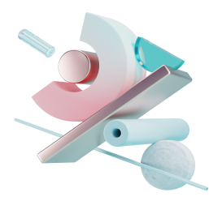

 

# Sign.Up.Page

## Daily UI Design Challenge | Day - 01 | Sign Up Page

[Ver Proyecto](https://mrbanano.github.io/Sign.Up.Page/)

[Diseño by DesignSense](https://www.youtube.com/channel/UCK3KESgQlmEBJ5DnRxWJ9oA)

 

**Sign up page** is a design of [DesignSense](https://www.youtube.com/channel/UCK3KESgQlmEBJ5DnRxWJ9oA), part of the challenge `Daily UI Design Challenge`, this page complies with the principle of models first for mobile devices, applying good practices and knowledge of html and css

#### developed with

## Desktop

## Tablet

## Mobile

 
 
 

## Stats

 
 

## Lighthouse

 
 

Diseñado con ♥️ por [Alvaro Castillo](https://www.linkedin.com/in/alvaro-castillo-c/)

